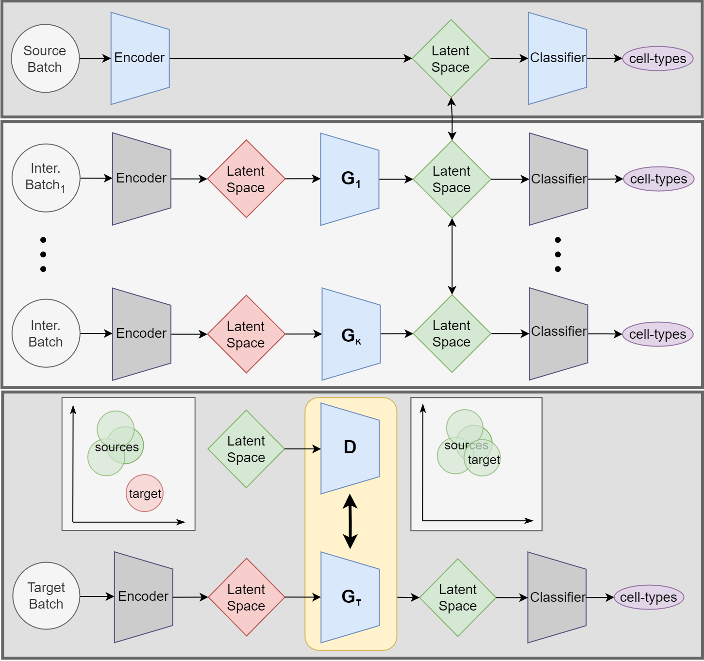

# JIND-Multi
##  
#### Publication:  

<!-- ABOUT THE PROJECT -->
## Description
<p align="center">
    
</p>

We introduce JIND-Multi, an extended version of the JIND framework designed for label transfer across datasets using multiple labeled datasets. When applied to single-cell RNA sequencing (scRNA-Seq) data, 
JIND-Multi demonstrates a significant reduction in the proportion of unclassified cells while preserving accuracy and performance equivalent to JIND. 

Notably, our model achieves robust and accurate results 
in its inaugural application to scATAC-Seq data, showcasing its effectiveness in this context.

### Built With
*   <a href="https://www.python.org/">
      
    </a>
*   <a href="https://pytorch.org/">
      
    </a>

## Clone repository & create the Conda environment
To crate a Conda environment using the provided environment.yml, follow these steps:

```bash
git clone https://github.com/ML4BM-Lab/JIND-Multi.git
cd jind
conda env create -f environment.yml
conda activate jind
```
## Data
The datasets can be downloaded from the following links:  https://doi.org/10.5281/zenodo.11098805

## Applying the Model
Within the `main` folder, you will find a file named `main.py`, which carries out all the necessary steps to annotate a dataset using various differently annotated batches. To execute it, simply run the following Python script.

``` shell
python Main.py -dt pancreas -s 0 -t 2 -p /path_to/jind_multi
```
Here, `-dt` represents the name of the dataset to be loaded, `-s` signifies the primary source batch among the available annotated batches, `-t` denotes the target batch to annotate, and `-p` points to the path of the 'jind_multi' folder. 

Let's delve into a detailed explanation of what this code does:

First, the data is loaded and normalized using the `load_data` function from the `DataLoader.py` script. It loads the `ann` object from the path set in `ConfigLoader.py`, reads it as a dataframe with dimensions `num_cells x n_genes`, assigns the `batch` and `labels` columns, and performs common gene and label operations across different batches. Subsequently, it normalizes and transforms the data, performs dimension reduction on the top 5000 genes with the highest variance, and filters out cells using `filter_cells`, a function from `Utils.py` that removes cell types that are not sufficiently represented in any of the annotated batches. Additionaly, a `min_cell_type_population` is defined with a default value as 100, but it can be modified. Data processing is conducted with both annotated data and the target batch together.

```python
data = load_data(data_type=args.DATA_TYPE)
```
Next, the data is divided into `train_data`, containing both the source batch (primary annotated batch) and the remaining intermediate batches, and `test_data`, representing the target batch to annotate.

```python
train_data = data[data['batch'] != args.TARGET_DATASET_NAME]
test_data = data[data['batch'] == args.TARGET_DATASET_NAME]
```

Afterwards, the JIND Multi object is created, and we fit the `train_data`, the name of the source batch (`source_dataset_name`), and the path where we want to save the results (`output_path`).

```python
jind = JindWrapper(train_data=train_data, source_dataset_name=args.SOURCE_DATASET_NAME, output_path=args.PATH_WD+'/output/'+ args.DATA_TYPE)
```

Finally, JIND Multi is trained. The encoder and classifier are trained with the source batch, minimizing the categorical cross-entropy loss. Then, for each intermediate batch, `perform_domain_adaptation` function is executed to adapt each intermediate dataset to the latent space of the source. This involves creating a custom model for each data set, inserting two NN blocks with an arquitecture similar to JIND+'s generator. This training involves using the labels and minimizing the categorical cross-entropy loss while keeping the parameters of the encoder and classifier fixed.

After each adaptation, the encoder and classifier undergo a `ftune` using the batches trained up to that point. Once all batches are adapted, a final tuning is performed. 

The particular models for each training set are saved so that they can be reused for different target batches without needing to re-run Jind Multi on the same train data. Additionally, `val_stats` contains predictions and labels used to calculate specific thresholds for each cell type during training are saved, which application ensures that we don't generate predictions with low confidence.

Finally, the trained encoder and classifier are applied to the target batch. This involves aligning the latent space of the target using a GAN (since this time we do not have labels). The main advantage of JIND Multi is that this method allows to use more real samples to train the GAN, as we have different annotated batches adapted to the same latent space. Sequentially, the Discriminator is fed with target samples along with samples from one of the annotated batches each time, and the Generator is improved through competitive training.

```python
jind.train(target_data=test_data)
```

As mentioned earlier, if you have already trained JIND Multi on a `train_data` to annotate one target batch, you can reload these models and use them to annotate another batch. `file_paths` contains a list of paths to the custom models trained for your train_data.

```python
# Load the trained models
model = load_trained_models(file_paths, train_data, source_dataset_name, device)
# Load the val_stats
val_stats = load_val_stats(model_input_path, 'val_stats_trained_model.json') 
# Do Jind
jind.train(target_data=test_data, model=model, val_stats=val_stats)
```

        
   
       


